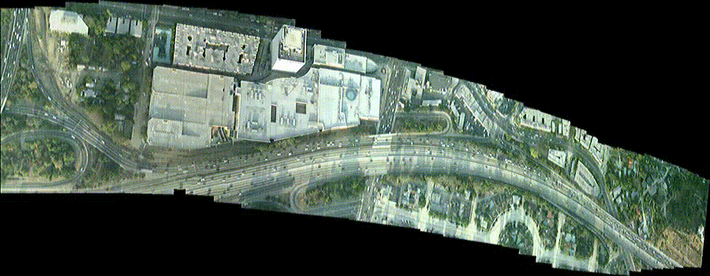

# AIPR-LITE 1(64-bit)
Mayachitra's Image registration software

AIPR-LITE 1(64-bit) is an easy-to-use extension to add image registration capabilities directly to your operating system. The software seamlessly integrates with Windows Explorer, providing new functions for creating stunningly beautiful panoramas with just a few clicks. AIPR Lite 1 comes with an incredibly simple user interface that enables you to create your panorama easily and, most important, without having to master any image processing concepts.  

AIPR-LITE 1(64-bit) is a software tool designed to register unordered sets of images and video streams in a completely automatic manner.This software employs state-of-the-art proprietary algorithms that are designed, integrated, and tuned specifically for unmanned aerial vehicles (UAVs) and satellite imagery offering unprecedented robustness and accuracy in presence of large distortions, scale variations, and even across different sensor modalities.

### Software Requirements
Version: 1.0.102.1343  
Release: July 11, 2010  
Operating Systems supported: Windows 2003, Windows Vista, Windows, Windows 7, Windows XP

### Contact Us
Mayachitra, Inc  
5266 Hollister Ave, Suite 229, Santa Barbara, CA, 93111  
Phone: 1-(805)-967-9828  
Fax: 1-(805)-456-4343  
Have more questions? Write to us by filling in this <a href="https://mayachitra.com/#contact-us">form</a>

